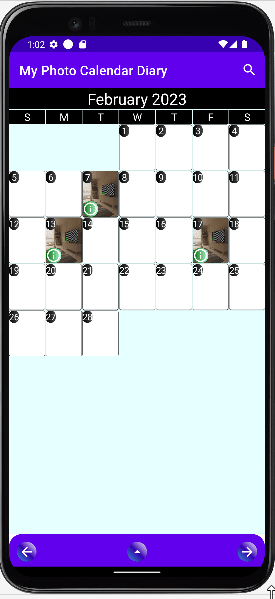
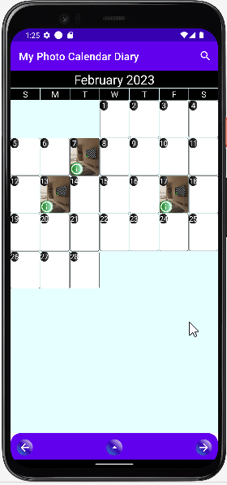

# My Photo Calendar Diary Android App

###This project demonstrates the following android development techniques:

* Using Kotlin Coroutine and Flow to observer UI state changes, and make UI changes accordingly
    | 

* 

