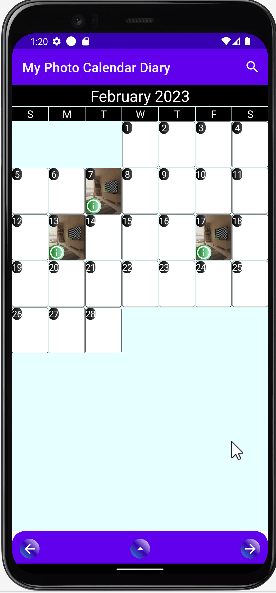

# My Photo Calendar Diary Android App

### This project demonstrates the following android development techniques:

* Hilt and Dagger Dependency Injection
* Room Database
* Jetpack Compose animation
* Using Kotlin Coroutine and Flow to observer UI state changes, and UI will react accordingly
     
* ComposeView and XML interoperability
* Jetpack Compose custom layout
* Custom layout animation to rearrange image and text positions

