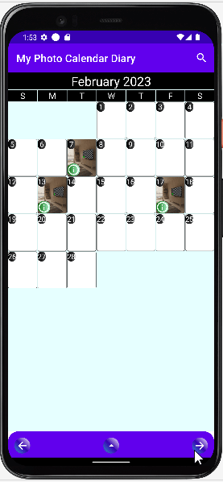

# My Photo Calendar Diary Android App

### This project demonstrates the following android development techniques:

* Hilt and Dagger Dependency Injection
* Room Database
* Jetpack Compose animation
* Using Kotlin Coroutine and Flow to observe UI state changes, and make UI changes accordingly. In below example, the search string will cause ui change and new database searches; all matching dates will be marked with red icon
     
* ComposeView and XML interoperability
* Jetpack Compose custom layout
* Layout animation to rearrange image and text positions

* Using Intent for image retrieval

